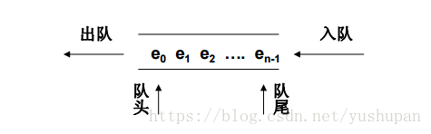

# 数据结构——队列
队列是一种列表，不同的是队列只能在队尾插入元素，在队首删除元素。

队列是一种先进先出（First-In-First-Out，FIFO）的数据结构。队列被用在很多地方，比如提交操作系统执行的一系列进程、打印任务池等，一些仿真系统用队列来模拟银行或杂货店里排队的顾客。

队列的常用操作：
* Queue()        定义一个空队列，无参数，返回值是空队列。
* enqueue(item)  在队列尾部加入一个数据项，参数是数据项，无返回值。
* dequeue()      删除队列头部的数据项，不需要参数，返回值是被删除的数据，队列本身有变化。
* isEmpty()      检测队列是否为空。无参数，返回布尔值。
* clear()        清空队列，无参无返回值
* size()         返回队列数据项的数量。无参数，返回一个整。
